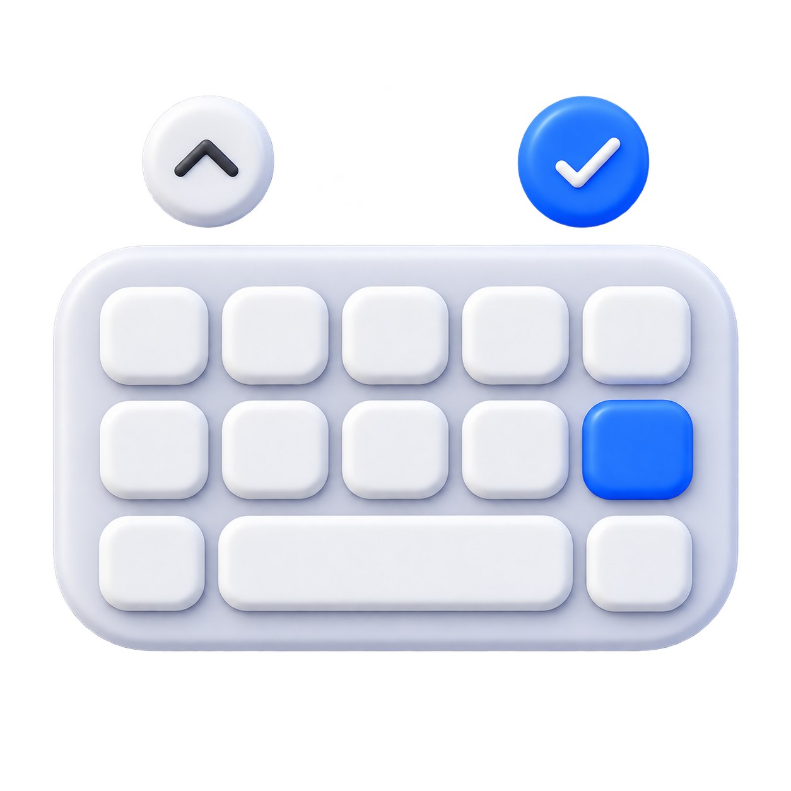

<p align="center">
  
</p>

# Compose Input Actions

**English** | [한국어](README_ko.md)

[](https://kotlinlang.org)
[](https://github.com/JetBrains/compose-multiplatform)
[](https://kotlinlang.org/docs/multiplatform.html)
[](LICENSE)

A Kotlin Multiplatform (KMP) library that brings native platform text-input actions and accessory toolbars to Compose Multiplatform `TextField`s.

On iOS, it attaches native `UIToolbar` keyboard accessory views directly to the active native text responder owned by Compose, while preserving full Compose ownership of your text state and focus lifecycle. On Android, Desktop (JVM), and macOS, it gracefully passes through (no-op) without altering standard text editing behavior, ensuring full cross-platform compatibility across your shared Compose code.

---

## Features

- **Compose-Idiomatic Modifier API**: Easily attach native actions to any Compose `TextField` using `Modifier.inputActions(...)`.
- **Focus-Aware Lifecycle**: Automatically presents and dismisses action toolbars when fields gain or lose focus.
- **SF Symbols & Custom Items**: Support for native iOS icons via SF Symbols, plain/done item styles, and flexible spacers (`InputAction.FlexibleSpace`).
- **Cross-Platform Compatibility**: Supports **iOS**, **Android**, **Desktop (JVM)**, and **macOS** target platforms. Wrap your UI tree with `InputActionsHost` inside `commonMain` for seamless multiplatform deployment.

### Supported Features & Platforms Matrix

| Feature | iOS | Android | Desktop (JVM) | macOS | Completion Rate | Under the Hood |
| :--- | :---: | :---: | :---: | :---: | :---: | :--- |
| **InputActionsHost** | 🟢 Yes | 🟢 Yes | 🟢 Yes | 🟢 Yes | **100%** | Common CompositionLocal host providing active action registries |
| **Modifier.inputActions** | 🟢 Yes | 🟢 Yes | 🟢 Yes | 🟢 Yes | **100%** | Modifier Node listening to `FocusEventModifierNode` events |
| **Plain & Emphasized Actions** | 🟢 Yes | 🟡 No-op | 🟡 No-op | 🟡 No-op | **95%** | Native `UIBarButtonItem` with `Plain` / `Done` styles on iOS |
| **Icon Actions (SF Symbols)** | 🟢 Yes | 🟡 No-op | 🟡 No-op | 🟡 No-op | **95%** | `UIImage.systemImageNamed(...)` on iOS |
| **Flexible Spacers** | 🟢 Yes | 🟡 No-op | 🟡 No-op | 🟡 No-op | **100%** | `UIBarButtonItem(barButtonSystemItem: .flexibleSpace)` on iOS |
| **Dynamic Action Updates** | 🟢 Yes | 🟢 Yes | 🟢 Yes | 🟢 Yes | **90%** | Real-time toolbar item array updates during focus |

---

## Installation

Add the dependency to your shared Kotlin Multiplatform module's `build.gradle.kts`:

```kotlin
kotlin {
    sourceSets {
        commonMain.dependencies {
            implementation("zone.ien.inputactions:inputactions:0.0.0")
        }
    }
}
```

### Setup

Wrap your Compose UI tree inside your shared `commonMain` code with `InputActionsHost`:

```kotlin
// commonMain/kotlin/App.kt
import zone.ien.inputactions.InputActionsHost

@Composable
fun App() {
    MaterialTheme {
        InputActionsHost {
            MainScreen()
        }
    }
}
```

- **iOS**: `InputActionsHost` intercepts focus events for fields using `Modifier.inputActions(...)` and attaches the native `UIToolbar` to the active iOS keyboard responder.
- **Android**: `InputActionsHost` acts as a seamless container (no-op), allowing standard Android software keyboard IME behavior to operate without additional layout configuration.

> [!IMPORTANT]
> **Toolchain Requirements**: Built and tested with **Kotlin 2.4.0** and **Compose Multiplatform 1.11.1** (compatible with Compose 1.12.x series). Ensure your project meets the minimum toolchain requirements.

---

## API Reference & Parameters

### 1. `InputActionsHost`

A wrapper `@Composable` component that establishes the local action registry host via CompositionLocal.

| Parameter | Type | Default | Description |
| :--- | :--- | :--- | :--- |
| `content` | `@Composable () -> Unit` | **Required** | The sub-tree containing `TextField` components configured with `inputActions`. |

---

### 2. `Modifier.inputActions`

Modifier extension for Compose text fields to register actions triggered when the field gains focus.

| Parameter | Type | Default | Description |
| :--- | :--- | :--- | :--- |
| `vararg actions` | `InputAction` | **Required** | Vararg list of `InputAction` instances presented in the native keyboard toolbar. |

---

### 3. `InputAction`

Represents an action item or spacer displayed in the keyboard accessory toolbar.

```kotlin
class InputAction(
    val title: String = "",
    val style: InputActionStyle = InputActionStyle.Plain,
    val icon: InputActionIcon? = null,
    val hidesSharedBackground: Boolean = false,
    val separatesSharedBackground: Boolean = false,
    val onClick: () -> Unit,
)
```

| Property | Type | Default | Description |
| :--- | :--- | :--- | :--- |
| `title` | `String` | `""` | Text label displayed on the action button. Can be empty for icon-only actions; ignored for `FlexibleSpace`. |
| `style` | `InputActionStyle` | `InputActionStyle.Plain` | Presentation style (`Plain` or `Done`). |
| `isFlexibleSpace` | `Boolean` | `false` | Indicates whether this item is a flexible spacer (`true`) or action button (`false`). |
| `icon` | `InputActionIcon?` | `null` | Optional platform icon. Displays an SF Symbol icon when specified on iOS. |
| `hidesSharedBackground` | `Boolean` | `false` | Hides the item's shared toolbar background on iOS 26+. This is different from separating two visible groups. |
| `separatesSharedBackground` | `Boolean` | `false` | Inserts UIKit's zero-width `fixedSpaceItem()` on iOS 26+ so adjacent groups keep their own backgrounds. |
| `onClick` | `() -> Unit` | **Required** | Callback executed when the action button is tapped. Ignored for `FlexibleSpace`. |

#### Companion Factories
- **`InputAction.FlexibleSpace`**: Standard flexible spacer dividing buttons.
- **`InputAction.FlexibleSpace(separatesSharedBackground: Boolean = false)`**: Flexible spacer with optional system group separation. This uses `UIBarButtonItem.fixedSpaceItem()` on iOS 26+.

#### Shared Background Groups

`separatesSharedBackground` keeps both backgrounds visible and adds a system separator between
two groups. It does not create a custom background, blur, or corner treatment.

- For a regular `InputAction`, the separator is placed immediately before that action. Put the
  option on the first action of the group that should begin after the boundary.
- For `InputAction.FlexibleSpace(separatesSharedBackground = true)`, the flexible gap remains and
  the separator is placed after that gap.
- When no `FlexibleSpace` is supplied and there are multiple actions, the library automatically
  inserts a flexible space before the final action. Use an explicit `FlexibleSpace` when the
  boundary needs to be unambiguous.
- On iOS versions before 26, the option has no system separator equivalent and the regular
  `UIToolbar` appearance is retained.

For example, this keeps `Next` and `Clear` in the left group and starts a separate `Done` group:

```kotlin
Modifier.inputActions(
    InputAction(title = "Next", onClick = { /* ... */ }),
    InputAction(title = "Clear", onClick = { /* ... */ }),
    InputAction.FlexibleSpace(separatesSharedBackground = true),
    InputAction(title = "Done", style = InputActionStyle.Done, onClick = { /* ... */ }),
)
```

Use `hidesSharedBackground` only when the intended result is to remove an item's shared
background entirely.

---

### 4. `InputActionStyle` (Enum)

Determines the visual appearance and behavior of an `InputAction`.

| Value | Description |
| :--- | :--- |
| `Plain` | Standard, non-emphasized action button style. |
| `Done` | Emphasized, bold completion action button style. |

---

### 5. `InputActionIcon`

Wrapper for platform-native icon references.

```kotlin
data class InputActionIcon(
    val systemName: String,
)
```

| Property | Type | Description |
| :--- | :--- | :--- |
| `systemName` | `String` | SF Symbol icon identifier on iOS (e.g., `"chevron.down"`, `"chevron.up"`, `"xmark.circle"`, `"checkmark"`). |

---

## Usage Example

Wrap your Compose hierarchy with `InputActionsHost` in `commonMain`, then attach `inputActions` modifiers to your text fields:

```kotlin
import androidx.compose.foundation.layout.Column
import androidx.compose.material3.OutlinedTextField
import androidx.compose.material3.Text
import androidx.compose.runtime.*
import androidx.compose.ui.Modifier
import androidx.compose.ui.focus.FocusRequester
import androidx.compose.ui.focus.focusRequester
import androidx.compose.ui.platform.LocalFocusManager
import zone.ien.inputactions.InputAction
import zone.ien.inputactions.InputActionIcon
import zone.ien.inputactions.InputActionStyle
import zone.ien.inputactions.InputActionsHost
import zone.ien.inputactions.inputActions

@Composable
fun RegistrationScreen() {
    val nameFocusRequester = remember { FocusRequester() }
    val emailFocusRequester = remember { FocusRequester() }
    val focusManager = LocalFocusManager.current

    var name by remember { mutableStateOf("") }
    var email by remember { mutableStateOf("") }

    InputActionsHost {
        Column {
            OutlinedTextField(
                value = name,
                onValueChange = { name = it },
                modifier = Modifier
                    .focusRequester(nameFocusRequester)
                    .inputActions(
                        InputAction(
                            title = "Next",
                            icon = InputActionIcon(systemName = "chevron.down"),
                            onClick = { emailFocusRequester.requestFocus() },
                        ),
                        InputAction.FlexibleSpace(separatesSharedBackground = true),
                        InputAction(
                            title = "Done",
                            style = InputActionStyle.Done,
                            onClick = { focusManager.clearFocus() },
                        ),
                    ),
                label = { Text("Name") },
            )

            OutlinedTextField(
                value = email,
                onValueChange = { email = it },
                modifier = Modifier
                    .focusRequester(emailFocusRequester)
                    .inputActions(
                        InputAction(
                            title = "Previous",
                            icon = InputActionIcon(systemName = "chevron.up"),
                            onClick = { nameFocusRequester.requestFocus() },
                        ),
                        InputAction.FlexibleSpace,
                        InputAction(
                            title = "Done",
                            style = InputActionStyle.Done,
                            onClick = { focusManager.clearFocus() },
                        ),
                    ),
                label = { Text("Email") },
            )
        }
    }
}
```

---

## Running the Sample App

The repository includes a Kotlin Multiplatform Compose sample application in the `example/` directory.

To run the sample app:

### Android
```bash
./gradlew :example:androidApp:installDebug
```

### iOS
Open `example/iosApp/iosApp.xcodeproj` in Xcode and select a simulator or physical target to run `iosApp`.

---

## Platform Limitations & Constraints

1. **Compose iOS Text Responder**: On iOS, native keyboard accessory view integration relies on Compose Multiplatform's native UIResponder text editing infrastructure.
2. **UIKit Hierarchy Traversal**: The native accessory bar dynamically attaches to the active responder view. Avoid forcing custom native input view replacements outside of `InputActionsHost`.
3. **Android Status**: Android software keypads natively manage IME action buttons. The library maintains complete API visibility on Android while delegating keyboard action handling to standard `KeyboardOptions(imeAction = ...)` mechanics.

---

## License

```
Copyright (c) 2026. Compose Input Actions project and open source contributors.
Copyright (c) 2026. IENGROUND of IENLAB.

Licensed under the Apache License, Version 2.0 (the "License");
you may not use this file except in compliance with the License.
You may obtain a copy of the License at

    http://www.apache.org/licenses/LICENSE-2.0

Unless required by applicable law or agreed to in writing, software
distributed under the License is distributed on an "AS IS" BASIS,
WITHOUT WARRANTIES OR CONDITIONS OF ANY KIND, either express or implied.
See the License for the specific language governing permissions and
limitations under the License.
```
